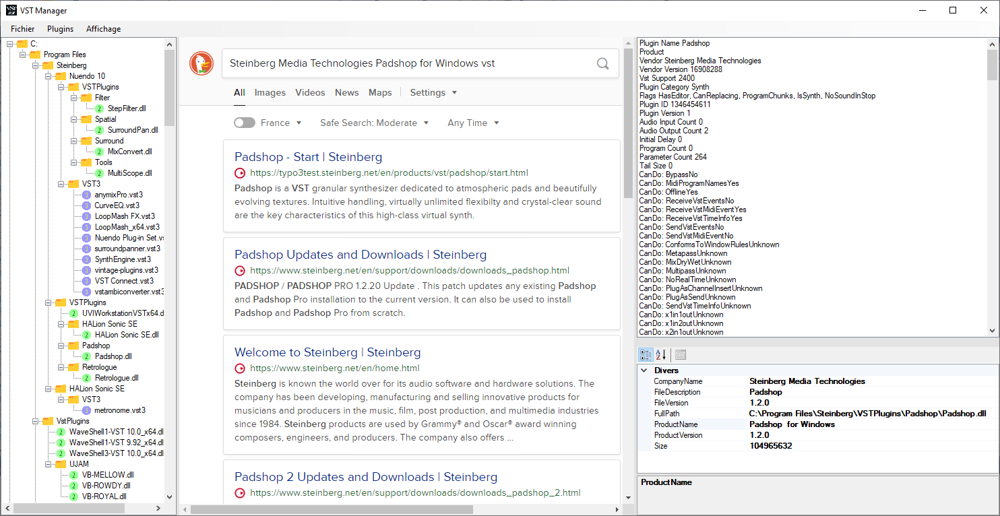

# VST Manager

## Overview

It's a winform .net 4 C# project to display information on VST plugins installed on a Windows computer. You can also find best price for music gear. Music shops prices are found by web scraping. Because I am french, I choosed shops that are accessible from France.  

## Dependencies

[CefSharp.Winform](https://github.com/cefsharp/cefsharp) : webview with Chromium

##
VST is a trademark of Steinberg Media Technologies GmbH.
